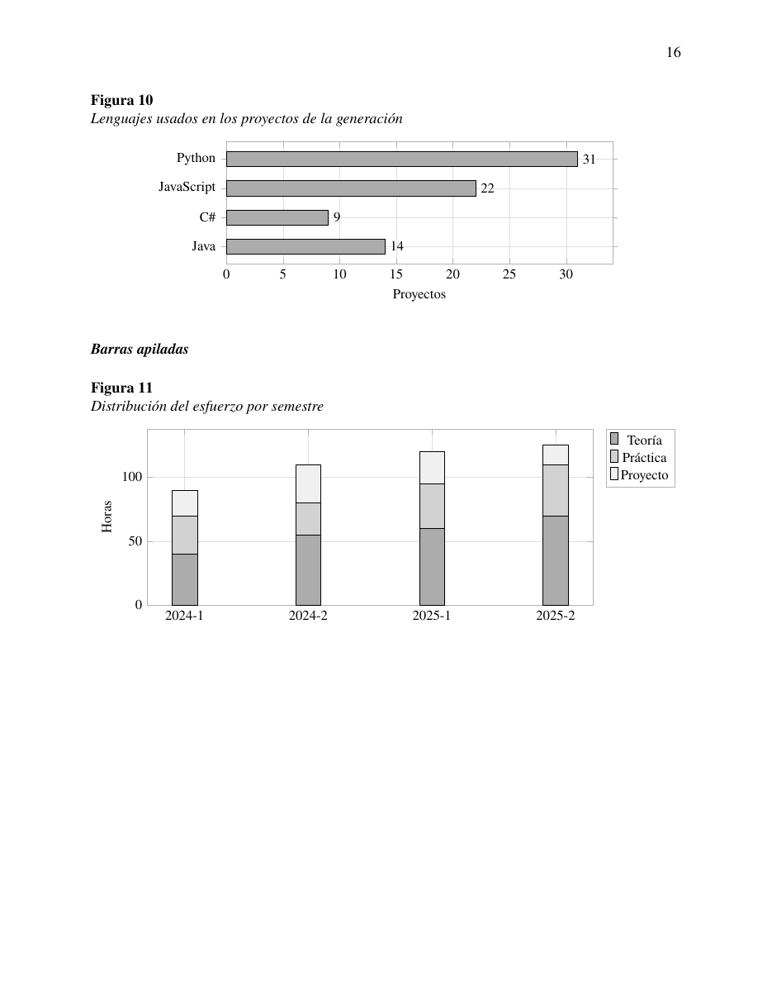

# Formato de Investigaciones

Escribe tu trabajo escolar en Markdown y obtén un PDF con formato APA 7:
portada, índice, encabezados, tablas, diagramas y gráficas, sin tocar Word ni
pelearte con LaTeX.

```
mi-trabajo.md  →  Pandoc  →  plantilla LaTeX  →  pdflatex  →  output/mi-trabajo.pdf
```

Tú escribes solo el contenido. La portada, la numeración, el índice, el
interlineado doble, la sangría y los pies de figura los pone el programa.

| | |
|---|---|
|  |  |

## Qué sabe hacer

- **Markdown completo.** Toda la sintaxis básica y extendida: tablas, notas al
  pie, listas de tareas, listas de definición, tachado, resaltado, subíndices,
  emoji a color y el HTML en línea que Markdown permite intercalar.
- **Portada APA con tus datos**, individual o de equipo, leídos de un archivo de
  configuración para no repetirlos en cada trabajo.
- **Diagramas de verdad.** Un bloque ```` ```dot ```` se dibuja con Graphviz:
  árboles, flujos, autómatas, modelos entidad-relación.
- **Gráficas de datos.** Un bloque ```` ```pgfplot ```` se calcula y se dibuja
  dentro del propio PDF: barras, líneas, dispersión con regresión, histogramas,
  caja y bigotes, pastel.
- **Imágenes locales y de internet.** Las de la web se descargan solas la
  primera vez y quedan guardadas para trabajar sin conexión.
- **Arte ASCII alineado.** Los diagramas hechos con caracteres de dibujo
  (`└ ─ ┼ │`) se componen como líneas reales.
- **Nunca te deja sin PDF.** Si falta un símbolo, una imagen no se descarga o
  Graphviz no está instalado, el trabajo se genera igual y el comando te avisa
  en la terminal de qué pasó.



## Requisitos

**Rust 1.88 o posterior** (para compilar el programa una vez), **Pandoc** y una distribución de
**TeX** con `pdflatex`. Graphviz es opcional y solo hace falta para los
diagramas. Funciona en Linux, Windows y macOS.

```bash
# Rust, en cualquier sistema: https://rustup.rs
curl --proto '=https' --tlsv1.2 -sSf https://sh.rustup.rs | sh

# Arch o Manjaro
sudo pacman -S pandoc graphviz texlive-basic texlive-latexextra \
  texlive-fontsextra texlive-langspanish texlive-pictures texlive-plaingeneric

# Debian o Ubuntu
sudo apt install pandoc graphviz \
  texlive-latex-recommended texlive-latex-extra texlive-fonts-extra \
  texlive-lang-spanish texlive-pictures texlive-plain-generic

# Windows
winget install Rustlang.Rustup JohnMacFarlane.Pandoc Graphviz.Graphviz MiKTeX.MiKTeX

# macOS
brew install rustup pandoc graphviz && brew install --cask mactex-no-gui
```

Las instrucciones completas, con Fedora, openSUSE, la lista de paquetes de LaTeX
y cómo comprobar que no falta nada, están en **[REQUISITOS.md](REQUISITOS.md)**.

## Instalación

```bash
git clone <url-del-repositorio>
cd FormatoInvestigaciones
cargo install --path .           # deja `investigacion` en ~/.cargo/bin
cp .env.example .env             # En Windows: copy .env.example .env
```

Edita `.env` con los datos que no cambian entre trabajos (universidad, facultad,
semestre y tu nombre).

El programa recuerda dónde está el proyecto, así que funciona desde cualquier
carpeta. Si mueves el repositorio, vuelve a ejecutar `cargo install --path .` o
indica la ruta en la variable `INVESTIGACION_HOME`.

### Las carpetas del proyecto

```
input/       tus trabajos en Markdown, en subcarpetas por materia (IA/, IS/...)
output/      los PDF generados (output/IA/... si usas un perfil con carpeta)
courses/    perfiles de materia: nombre, docente, grupo, plantilla y carpeta
templates/   diseños de portada (apa, apa-simple), el preámbulo común y los logos
cache/       imágenes descargadas, diagramas y el estado de LaTeX; se puede borrar
examples/     ejemplos y el catálogo de elementos
```

En el menú interactivo, la tecla `f` abre cualquiera de estas carpetas en el
explorador de archivos.

### Los logos de tu institución

El repositorio **no incluye ningún logo**: los de una universidad rara vez son
redistribuibles. Deja los tuyos en `templates/logos/` con estos nombres:

| Archivo | Dónde sale |
|---|---|
| `logo-universidad.png` | Arriba a la izquierda de la portada |
| `logo-facultad.png` | Arriba a la derecha |

Si prefieres tenerlos fuera del proyecto, indica la carpeta con `--logos` o deja
la ruta fija en la variable `LOGOS` del `.env`. Los dos archivos son opcionales:
sin ellos la portada se genera igual, solo que sin logos. Más detalles en
[`templates/logos/LEEME.md`](templates/logos/LEEME.md).

## Inicio rápido

La forma más cómoda es el menú interactivo:

```bash
investigacion
```

Eliges el perfil de la materia, el Markdown de una lista (flechas y Enter, sin
escribir rutas), escribes el título y pulsas `g`.

Desde la línea de comandos:

```bash
# 1. Parte del esqueleto incluido
cp examples/paper-template.md input/mi-trabajo.md

# 2. Escribe el contenido en Markdown

# 3. Genera el PDF
investigacion mi-trabajo.md --title "Ecuaciones diferenciales" --course "Cálculo"
```

El resultado queda en `output/mi-trabajo.pdf`: el nombre del archivo sale del
Markdown y es **independiente del título**. Para cambiarlo, `--file-name`.

Solo **el título y la materia** son obligatorios; el resto de los datos son
opcionales o salen del `.env`. Y no hace falta escribir la carpeta: los trabajos
viven en `input/` y el comando los busca ahí solo, incluso dentro de subcarpetas
por materia:

```
input/
  IS/Actividad1.md   →  investigacion Actividad1.md
  Economia.md        →  investigacion Economia.md
```

### Perfiles de materia

Los datos que se repiten en todos los trabajos de una materia se guardan una vez
en `courses/<clave>.toml` (hay un `courses/example.toml` para copiar):

```toml
name = "Inteligencia artificial"
teacher = "Nombre del docente"
group = "7-A"
template = "apa"      # o apa-simple
folder = "IA"         # input/IA y output/IA
```

```bash
investigacion Tarea1.md -p ia --title "Búsqueda heurística"
```

### Plantillas

`--template apa` (la de siempre, con la portada geométrica) o
`--template apa-simple` (portada clásica centrada). Cada plantilla es una
carpeta de `templates/` con un `template.ltx`; todas comparten el preámbulo de
`templates/common/`, así que una nueva solo tiene que diseñar su portada.

Las opciones de antes en español (`--titulo`, `--materia`, `--docente`…) siguen
funcionando.

## El catálogo

[`examples/catalog.md`](examples/catalog.md) reúne un ejemplo de **cada cosa que
el programa sabe componer**: los cinco niveles de encabezado APA, las cuatro
clases de lista, cinco variantes de tabla, siete diagramas de Graphviz, doce
gráficas y las fórmulas, cada uno con el código que lo produce.

El PDF que genera está en el repositorio para verlo sin instalar nada:
[`examples/catalog.pdf`](examples/catalog.pdf) (23 páginas).

```bash
investigacion examples/catalog.md --title "Catalogo" --course "Ejemplo" --teacher "Ejemplo"
```

## Pedirle el trabajo a una IA

**[PROMPT-IA.md](PROMPT-IA.md)** trae un prompt listo para copiar que le explica
al modelo todo lo que el generador sabe componer: la estructura que debe seguir,
la sintaxis completa, cómo escribir un diagrama de Graphviz, los doce tipos de
gráfica y cómo dejar las referencias en APA.

Pegas el prompt, añades tu tema, guardas la respuesta en `input/` y generas el
PDF. El resultado aprovecha tablas, diagramas y gráficas en vez de quedarse en
párrafos sueltos.

## Documentación

- **[REQUISITOS.md](REQUISITOS.md)** — qué instalar en cada sistema operativo y
  cómo comprobar que no falta nada.
- **[GUIA.md](GUIA.md)** — cómo funciona por dentro, todas las opciones del
  comando, la sintaxis completa que acepta y qué hacer cuando algo falla.
- **[PROMPT-IA.md](PROMPT-IA.md)** — el prompt para que una IA te redacte el
  trabajo en este formato.
- **[MEJORAS.md](MEJORAS.md)** — qué cambió con la versión en Rust y por qué.
- **[CLAUDE.md](CLAUDE.md)** — notas de arquitectura para quien vaya a tocar el
  código: los contratos entre las piezas y las trampas encontradas.

## Ejemplos incluidos

| Archivo | Qué es |
|---|---|
| `examples/paper-template.md` | Esqueleto vacío para empezar un trabajo |
| `examples/syntax.md` | Referencia breve de la sintaxis de Markdown |
| `examples/catalog.md` | Muestrario completo de todos los elementos |
| `examples/binary-trees.md` | Un trabajo real de ejemplo, con diagramas |

Tus propios trabajos van en `input/`, que está en `.gitignore`: no se suben al
repositorio.

## Pruebas

```bash
cargo test
```

Las que generan un PDF real se omiten solas si Pandoc, pdflatex o Graphviz no
están instalados.

## Licencia

[GPL-3.0-or-later](LICENSE). Puedes usarlo, estudiarlo, modificarlo y
distribuirlo; si distribuyes una versión modificada, tiene que seguir siendo
libre bajo la misma licencia.
