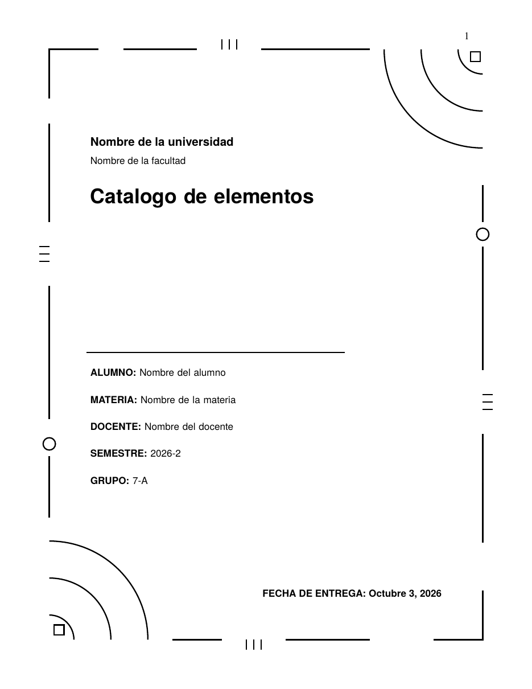

# Formato de Investigaciones

Write your school paper in Markdown once and get a PDF in the format you
need (APA 7, Harvard, MLA 9 or your own design), with cover page, table of
contents, headings, tables, diagrams and charts. No Word and no hand-written
LaTeX.

```
paper.md  →  Pandoc  →  format + design (LaTeX)  →  pdflatex  →  output/paper.pdf
```

| | |
|---|---|
|  |  |

The program's menu, messages and help are in **Spanish or English**, and you
choose the language the first time you open it.

## What it does

- **Formats and designs, kept separate.**
  - The **format** is the norm: font, spacing, headings, captions and
    references.
  - The **design** is the cover and the look.
  - Built in: the formats `apa7`, `harvard` and `mla`, and the designs
    `geometric-cover`, `classic-cover`, `report` and `starter`. Any design
    that lists a format can be combined with it.
- **Your own designs.** You can add designs in `my-templates/designs/`. If a
  design uses a variable of its own (e.g. `%%SALON%%`), the menu asks for it.
  `investigacion --check-template <design>` checks a design before you use
  it.
- **Profiles per course.** A wizard asks for everything once: format, design
  and all the cover data. Each profile keeps its own data.
- **Full Markdown.** Tables, footnotes, task and definition lists, highlight,
  sub/superscript, emoji and inline HTML, plus Graphviz diagrams
  (` ```dot `) and pgfplots charts (` ```pgfplot `).
- **Always produces a PDF.** A missing symbol, image or Graphviz gives a
  warning instead of a failure.
- **Fast re-runs.** Generating the same paper again usually takes a single
  LaTeX pass.


## Requirements

[Rust](https://rustup.rs) 1.88+, [Pandoc](https://pandoc.org) and a TeX
distribution with `pdflatex`. Graphviz is optional and only needed for
diagrams. It works on Linux, Windows and macOS. The commands for each system
are in **[INSTALL.md](INSTALL.md)**.

## Install

```bash
git clone -b mejoras-rust https://github.com/PeterOlveraO/FormatoInvestigaciones.git
cd FormatoInvestigaciones
cargo install --path .        # puts `investigacion` in ~/.cargo/bin
```

Keep the folder where you cloned it: the program uses it to find formats,
designs, profiles and your papers.

## First run

Run `investigacion`. The first time it:

1. asks for the language (Español / English);
2. opens the **profile wizard**: profile name → format → design (only the ones
   that work with that format) → the data that design shows (university,
   faculty, student or team, course, teacher, group, semester, its own fields)
   → the folder for that course's papers.

The profile is saved in `courses/<name>.toml`. Optionally, put your logos in
`templates/logos/` (`logo-universidad.png`, `logo-facultad.png`).

## Use

Put your papers in `input/`, one subfolder per course if you like (`input/IA/`…).

**Menu** (`investigacion` with no arguments): choose the profile, the Markdown
from a list and write the title.

| Key | Action |
|---|---|
| ↑ ↓, Enter | Move and edit; fields marked ▸ open a list (profile, Markdown, format, design) |
| `g` | Generate the PDF |
| `p` | Create a profile, or edit the chosen one |
| `v` | View the last PDF |
| `c` / `f` | Open a project folder |
| `l` | Switch language (Español / English) |
| `s` / `q` | Quit |

**Command line:**

```bash
investigacion Tarea1.md -p ia --title "Búsqueda heurística"
investigacion paper.md --title "Tema" --course "Materia" --format mla --design report
```

The PDF is named after the Markdown file (`Tarea1.md` → `tarea1.pdf`), not
after the title. Use `--file-name` to choose another name.

## Documentation

- **[INSTALL.md](INSTALL.md)**: installation per operating system, updating and
  installation problems.
- **[GUIDE.md](GUIDE.md)**:
  - every option, profiles, formats and designs;
  - how to make your own design;
  - the Markdown syntax and what to do when something fails.
- **[AI-PROMPT.md](AI-PROMPT.md)**: a ready-to-paste prompt so an AI writes the
  paper in this format.
- **[CHANGELOG.md](CHANGELOG.md)**: what changed between versions.
- `examples/`:
  - a paper template, a syntax reference and a full example paper;
  - the catalog of every element, also as
    [`examples/catalog.pdf`](examples/catalog.pdf).

## License

[GPL-3.0-or-later](LICENSE).
