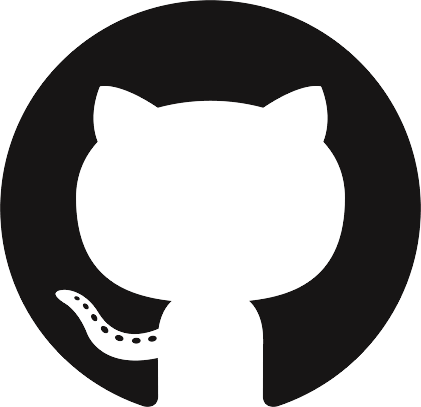

# Introducción

Este documento es el catálogo de todo lo que el generador sabe componer. No es
un trabajo de verdad: cada sección muestra un elemento, el código que lo produce
y cómo queda en el PDF.

Sirve para dos cosas. Para copiar la forma exacta de escribir una gráfica o un
diagrama sin acordarse de la sintaxis, y para dárselo a una inteligencia
artificial como especificación del formato en el que tiene que entregar la
investigación.

La regla que sostiene todo lo demás es una sola: **cada bloque va separado por
una línea vacía**. Antes y después de un encabezado, de una lista, de una tabla,
de un diagrama y de un bloque de código.

## Lo que no se escribe en el Markdown

Ni portada, ni índice, ni el título del trabajo, ni el nombre del alumno, ni la
materia, ni la fecha: todo eso lo pone la plantilla con lo que se le pasa al
comando. El documento empieza directamente en `# Introducción`.

# Desarrollo

## Encabezados

Se escriben con almohadillas y un espacio. El nivel decide el formato APA, así
que conviene no saltarse ninguno.

### Encabezado de tercer nivel

A la izquierda, en negrita cursiva.

#### Encabezado de cuarto nivel

Se mete en el párrafo, con sangría y punto final.

##### Encabezado de quinto nivel

El último que distingue APA, en negrita cursiva dentro del párrafo.

## Texto

Dentro de un párrafo caben la **negrita**, la *cursiva*, las ***dos a la vez***,
el `código en línea`, el ~~tachado~~ y el ==resaltado==. También los subíndices
como H~2~O y los superíndices como en X^2^. Para cortar un renglón a
propósito<br>se usa una etiqueta de salto.

Los enlaces tienen cuatro formas: [con su texto](https://www.latex-project.org),
con [título emergente](https://www.latex-project.org "El proyecto LaTeX"), como
dirección desnuda <https://pandoc.org> y por referencia, como el
[manual de Markdown][guia]. Una nota al pie[^cat] se ancla con un corchete.

[guia]: https://www.markdownguide.org

[^cat]: Las notas al pie se escriben en cualquier parte del documento; LaTeX las
coloca al pie de la página que les toca.

Para que un símbolo de Markdown salga tal cual se escapa con una contrabarra:
\*asterisco\*, \_guion bajo\_, \# almohadilla, \[corchete\].

## Listas

Las listas con viñetas usan un guion y se anidan con dos espacios:

- Primer elemento
- Segundo elemento
  - Anidado en el segundo nivel
    - Y en el tercero
- Tercer elemento

Las numeradas funcionan igual:

1. Primer paso
2. Segundo paso
   1. Subpaso
   2. Otro subpaso
3. Tercer paso

Las de tareas llevan una casilla:

- [x] Redactar la introducción
- [ ] Terminar el análisis
- [ ] Revisar las referencias

Y las de definición sirven de glosario:

Algoritmo
: Secuencia finita de instrucciones que resuelve un problema.

Complejidad
: Medida de los recursos que consume un algoritmo según el tamaño de la entrada.

## Citas

> Una cita en bloque se escribe con el signo de mayor que.
>
> Puede tener varios párrafos, **formato** dentro y hasta
>
> > otra cita anidada.

## Cajas destacadas

Para resaltar algo sin romper el hilo del texto:

````markdown
::: nota
El contenido de la caja va aquí.
:::
````

::: nota
Hay cinco tipos: `nota`, `aviso`, `importante`, `ejemplo` y `definicion`.
:::

::: aviso
El título se puede cambiar escribiendo `::: {.aviso title="Antes de entregar"}`.
:::

::: {.definicion title="Árbol binario de búsqueda"}
Estructura de datos donde cada nodo tiene a lo sumo dos hijos y toda clave del
subárbol izquierdo es menor que la del nodo.
:::

## Tablas

Una tabla necesita la fila de guiones debajo de los encabezados. Los dos puntos
en esa fila deciden la alineación de cada columna: `:---` izquierda, `:---:`
centro y `---:` derecha.

### Tabla simple

| Modelo | Cuándo conviene | Riesgo |
|---|---|---|
| Cascada | Requisitos estables | Bajo |
| Prototipos | Requisitos poco claros | Medio |
| Espiral | Proyectos grandes | Alto |

### Tabla con alineación y formato dentro de las celdas

| Concepto | Alineado al centro | Alineado a la derecha |
|:---------|:------------------:|----------------------:|
| **Negrita** | `código` | 1,250.00 |
| *Cursiva* | [Enlace](https://pandoc.org) | 980.50 |
| ~~Descartado~~ | Nota al pie[^tabla] | -45.75 |

[^tabla]: Una nota al pie también funciona dentro de una celda.

### Tabla numérica

| Algoritmo | Mejor caso | Caso promedio | Peor caso | Memoria |
|:----------|:----------:|:-------------:|:---------:|:-------:|
| Burbuja | Θ(n) | Θ(n²) | Θ(n²) | Θ(1) |
| Inserción | Θ(n) | Θ(n²) | Θ(n²) | Θ(1) |
| Mezcla | Θ(n log n) | Θ(n log n) | Θ(n log n) | Θ(n) |
| Rápido | Θ(n log n) | Θ(n log n) | Θ(n²) | Θ(log n) |
| Montículo | Θ(n log n) | Θ(n log n) | Θ(n log n) | Θ(1) |

### Tabla larga

Cuando una tabla no cabe en la página se parte sola y repite el encabezado.

| Fase | Actividad | Responsable | Duración |
|---|---|---|---|
| Análisis | Entrevistas con el cliente | Analista | 2 semanas |
| Análisis | Documento de requisitos | Analista | 1 semana |
| Diseño | Arquitectura general | Arquitecto | 2 semanas |
| Diseño | Diseño de la base de datos | Arquitecto | 1 semana |
| Diseño | Prototipo de interfaz | Diseñador | 1 semana |
| Construcción | Módulo de acceso | Programador | 3 semanas |
| Construcción | Módulo de reportes | Programador | 3 semanas |
| Construcción | Integración | Programador | 1 semana |
| Pruebas | Pruebas unitarias | Programador | 2 semanas |
| Pruebas | Pruebas de aceptación | Cliente | 1 semana |
| Despliegue | Puesta en producción | Operaciones | 1 semana |
| Despliegue | Capacitación | Analista | 2 semanas |

## Código

El código en línea va entre acentos graves: `git commit -m "mensaje"`.

Un bloque con el lenguaje indicado sale con resaltado de sintaxis:

```python
def busqueda_binaria(lista, objetivo):
    """Devuelve la posición del objetivo, o -1 si no está."""
    izquierda, derecha = 0, len(lista) - 1
    while izquierda <= derecha:
        medio = (izquierda + derecha) // 2
        if lista[medio] == objetivo:
            return medio
        if lista[medio] < objetivo:
            izquierda = medio + 1
        else:
            derecha = medio - 1
    return -1
```

```sql
SELECT a.nombre, COUNT(i.id) AS inscripciones
FROM alumnos a
LEFT JOIN inscripciones i ON i.alumno_id = a.id
WHERE a.semestre = 7
GROUP BY a.nombre
HAVING COUNT(i.id) > 3
ORDER BY inscripciones DESC;
```

```bash
find . -name "*.md" -newermt "-7 days" | xargs wc -l | sort -rn | head
```

```json
{
  "materia": "Estructuras de Datos",
  "unidades": [1, 2, 3],
  "evaluacion": { "practicas": 0.4, "examen": 0.6 }
}
```

Un bloque sin lenguaje sale en letra monoespaciada, sin colores:

```
Entrada:  [5, 3, 8, 1]
Proceso:  ordenar
Salida:   [1, 3, 5, 8]
```

## Diagramas de arte ASCII

Un esquema hecho con caracteres de dibujo tiene que ir dentro de un bloque de
código, porque solo ahí la letra es de ancho fijo y el dibujo no se desalinea:

```
  Requisitos
      └──► Diseño
              └──► Codificación
                      └──► Pruebas

        ┌──────────── refinamiento ────────────┐
        │                                      │
        ▼                                      │
   Recolección  ──►  Construcción  ──►  Evaluación
```

## Diagramas dibujados con Graphviz

Un bloque marcado como `dot` no se muestra como código: lo dibuja Graphviz y se
inserta como imagen vectorial. El `caption` es opcional y pone el pie de figura.

````markdown
```{.dot caption="Jerarquía de clases"}
digraph {
  node [shape=box, style=rounded];
  "Figura" -> "Círculo";
  "Figura" -> "Polígono";
}
```
````

### Jerarquía o árbol

```{.dot caption="Jerarquía de clases de un sistema de figuras"}
digraph {
  graph [ranksep=0.45];
  node  [shape=box, style=rounded, fontname="Helvetica", fontsize=10];
  edge  [arrowsize=0.7];

  "Figura" -> "Círculo";
  "Figura" -> "Polígono";
  "Polígono" -> "Triángulo";
  "Polígono" -> "Cuadrilátero";
  "Cuadrilátero" -> "Rectángulo";
}
```

### Flujo de izquierda a derecha

```{.dot caption="Tubería de compilación del generador"}
digraph {
  graph [rankdir=LR, ranksep=0.5];
  node  [shape=box, style=rounded, fontname="Helvetica", fontsize=10];
  edge  [arrowsize=0.7];

  "archivo.md" -> "Pandoc" -> "plantilla LaTeX" -> "pdflatex" -> "PDF";
}
```

### Diagrama de flujo con decisiones

```{.dot caption="Búsqueda en un árbol binario"}
digraph {
  graph [ranksep=0.35];
  node  [fontname="Helvetica", fontsize=10];
  edge  [arrowsize=0.7, fontname="Helvetica", fontsize=9];

  inicio  [shape=ellipse, label="Inicio"];
  vacio   [shape=diamond, label="¿Nodo vacío?"];
  igual   [shape=diamond, label="¿Clave igual?"];
  menor   [shape=diamond, label="¿Clave menor?"];
  izq     [shape=box, label="Bajar a la izquierda"];
  der     [shape=box, label="Bajar a la derecha"];
  hallado [shape=ellipse, label="Encontrada"];
  nulo    [shape=ellipse, label="No está"];

  inicio -> vacio;
  vacio -> nulo    [label="sí"];
  vacio -> igual   [label="no"];
  igual -> hallado [label="sí"];
  igual -> menor   [label="no"];
  menor -> izq     [label="sí"];
  menor -> der     [label="no"];
  izq -> vacio;
  der -> vacio;
}
```

### Grafo no dirigido con pesos

Con `graph` en vez de `digraph` las aristas no llevan flecha.

```{.dot caption="Red de ciudades con distancias en kilómetros"}
graph {
  layout=neato;
  node [shape=circle, fontname="Helvetica", fontsize=10, width=0.6];
  edge [fontname="Helvetica", fontsize=9, len=1.8];

  Norte  -- Centro [label="20"];
  Centro -- Sur    [label="25"];
  Sur    -- Este   [label="38"];
  Este   -- Norte  [label="60"];
}
```

### Máquina de estados

```{.dot caption="Autómata que acepta cadenas terminadas en 01"}
digraph {
  graph [rankdir=LR];
  node  [shape=circle, fontname="Helvetica", fontsize=10];
  edge  [fontname="Helvetica", fontsize=9, arrowsize=0.7];

  inicio [shape=point, width=0.1];
  q2 [shape=doublecircle];

  inicio -> q0;
  q0 -> q0 [label="1"];
  q0 -> q1 [label="0"];
  q1 -> q1 [label="0"];
  q1 -> q2 [label="1"];
  q2 -> q1 [label="0"];
  q2 -> q0 [label="1"];
}
```

### Agrupaciones

Un `subgraph cluster_...` encierra parte del diagrama en un recuadro.

```{.dot caption="Arquitectura en tres capas"}
digraph {
  graph [ranksep=0.4];
  node  [shape=box, style=rounded, fontname="Helvetica", fontsize=10];
  edge  [arrowsize=0.7];

  subgraph cluster_presentacion {
    label="Presentación"; fontname="Helvetica"; fontsize=10; color=gray60;
    Web; Móvil;
  }
  subgraph cluster_negocio {
    label="Lógica de negocio"; fontname="Helvetica"; fontsize=10; color=gray60;
    Servicios; Reglas;
  }
  subgraph cluster_datos {
    label="Datos"; fontname="Helvetica"; fontsize=10; color=gray60;
    "Base de datos";
  }

  Web -> Servicios; Móvil -> Servicios;
  Servicios -> Reglas -> "Base de datos";
}
```

### Entidades y atributos

La forma `record` divide el nodo en campos, útil para un modelo de datos.

```{.dot caption="Modelo entidad-relación simplificado"}
digraph {
  graph [rankdir=LR, ranksep=0.7];
  node  [shape=record, fontname="Helvetica", fontsize=9];

  alumno [label="{Alumno|id : entero\lnombre : texto\lsemestre : entero\l}"];
  curso  [label="{Curso|id : entero\lnombre : texto\lcreditos : entero\l}"];
  insc   [label="{Inscripción|alumno\_id : entero\lcurso\_id : entero\lcalificacion : real\l}"];

  alumno -> insc [label="1..n", fontsize=9];
  curso  -> insc [label="1..n", fontsize=9];
}
```

## Gráficas de datos

Un bloque marcado como `pgfplot` se dibuja dentro del propio PDF, así que la
gráfica sale vectorial y con la misma tipografía que el texto. Aquí sí importa
la sintaxis: un error detiene la compilación y el comando indica la línea.

````markdown
```{.pgfplot caption="Título de la figura"}
\begin{axis}[xlabel={Eje X}, ylabel={Eje Y}]
  \addplot coordinates {(1,10) (2,20) (3,15)};
\end{axis}
```
````

### Barras verticales

```{.pgfplot caption="Horas dedicadas por fase del proyecto"}
\begin{axis}[
  ybar, ymin=0, bar width=18pt, nodes near coords,
  ylabel={Horas}, symbolic x coords={Análisis,Diseño,Código,Pruebas},
  xtick=data, enlarge x limits=0.18]
  \addplot coordinates {(Análisis,120) (Diseño,95) (Código,180) (Pruebas,140)};
\end{axis}
```

### Barras agrupadas

```{.pgfplot caption="Defectos encontrados por fase y por equipo"}
\begin{axis}[
  ybar, ymin=0, bar width=10pt,
  ylabel={Defectos}, symbolic x coords={Análisis,Diseño,Código,Pruebas},
  xtick=data, enlarge x limits=0.18, legend pos=north west]
  \addplot coordinates {(Análisis,12) (Diseño,18) (Código,45) (Pruebas,30)};
  \addplot coordinates {(Análisis,8) (Diseño,14) (Código,38) (Pruebas,22)};
  \legend{Equipo A, Equipo B}
\end{axis}
```

### Barras horizontales

Útiles cuando las etiquetas son largas.

```{.pgfplot caption="Lenguajes usados en los proyectos de la generación"}
\begin{axis}[
  xbar, xmin=0, bar width=12pt, nodes near coords,
  xlabel={Proyectos}, symbolic y coords={Java,C\#,JavaScript,Python},
  ytick=data, enlarge y limits=0.2, width=0.75\linewidth, height=5cm]
  \addplot coordinates {(14,Java) (9,C\#) (22,JavaScript) (31,Python)};
\end{axis}
```

### Barras apiladas

```{.pgfplot caption="Distribución del esfuerzo por semestre"}
\begin{axis}[
  ybar stacked, ymin=0, bar width=20pt,
  ylabel={Horas}, symbolic x coords={2024-1,2024-2,2025-1,2025-2},
  xtick=data, legend pos=outer north east]
  \addplot coordinates {(2024-1,40) (2024-2,55) (2025-1,60) (2025-2,70)};
  \addplot coordinates {(2024-1,30) (2024-2,25) (2025-1,35) (2025-2,40)};
  \addplot coordinates {(2024-1,20) (2024-2,30) (2025-1,25) (2025-2,15)};
  \legend{Teoría, Práctica, Proyecto}
\end{axis}
```

### Líneas

```{.pgfplot caption="Avance del proyecto durante el semestre"}
\begin{axis}[
  xlabel={Semana}, ylabel={Avance (\%)}, ymin=0, ymax=100,
  legend pos=north west, xtick={2,4,6,8,10,12,14,16}]
  \addplot coordinates {(2,5) (4,15) (6,28) (8,45) (10,58) (12,72) (14,88) (16,100)};
  \addplot coordinates {(2,6) (4,12) (6,19) (8,25) (10,44) (12,60) (14,75) (16,95)};
  \legend{Planeado, Real}
\end{axis}
```

### Dispersión con recta de regresión

pgfplots calcula la regresión lineal por su cuenta.

```{.pgfplot caption="Relación entre horas de estudio y calificación"}
\begin{axis}[xlabel={Horas de estudio}, ylabel={Calificación}, legend pos=south east]
  \addplot[only marks] table[x=horas, y=nota] {
    horas nota
    2 62
    3 68
    4 71
    5 79
    6 80
    7 88
    8 91
    9 95
  };
  \addplot[no marks, thick, black] table[x=horas, y={create col/linear regression={y=nota}}] {
    horas nota
    2 62
    3 68
    4 71
    5 79
    6 80
    7 88
    8 91
    9 95
  };
  \legend{Alumnos, Tendencia}
\end{axis}
```

### Histograma

```{.pgfplot caption="Distribución de calificaciones del grupo"}
\begin{axis}[ylabel={Alumnos}, xlabel={Calificación}, ymin=0]
  \addplot[hist={bins=6}, fill=gray!50, draw=black] table[y index=0] {
    nota
    62
    65
    68
    70
    71
    73
    75
    75
    78
    80
    81
    83
    85
    88
    90
    95
  };
\end{axis}
```

### Caja y bigotes

```{.pgfplot caption="Dispersión de calificaciones por grupo"}
\begin{axis}[
  boxplot/draw direction=y, ylabel={Calificación},
  xtick={1,2,3}, xticklabels={Grupo A, Grupo B, Grupo C},
  height=6cm, width=0.7\linewidth]
  \addplot+[fill=gray!55, boxplot prepared={lower whisker=60, lower quartile=70,
            median=78, upper quartile=85, upper whisker=95}] coordinates {};
  \addplot+[fill=gray!30, boxplot prepared={lower whisker=55, lower quartile=65,
            median=72, upper quartile=80, upper whisker=92}] coordinates {};
  \addplot+[fill=gray!10, boxplot prepared={lower whisker=68, lower quartile=75,
            median=82, upper quartile=89, upper whisker=98}] coordinates {};
\end{axis}
```

### Barras con margen de error

```{.pgfplot caption="Tiempo medio de respuesta con su desviación"}
\begin{axis}[
  ybar, ymin=0, bar width=18pt, ylabel={Milisegundos},
  symbolic x coords={v1.0,v1.1,v2.0}, xtick=data, enlarge x limits=0.3]
  \addplot+[error bars/.cd, y dir=both, y explicit]
    coordinates {(v1.0,240) +- (0,35) (v1.1,180) +- (0,22) (v2.0,95) +- (0,12)};
\end{axis}
```

### Funciones matemáticas

```{.pgfplot caption="Comparación del crecimiento de tres funciones"}
\begin{axis}[
  xlabel={$n$}, ylabel={Operaciones}, domain=1:50, samples=80,
  legend pos=north west, ymax=250]
  \addplot[mark=none, thick] {x^2/10};
  \addplot[mark=none, densely dashed, thick] {x};
  \addplot[mark=none, dotted, thick] {ln(x)/ln(2)};
  \legend{$\Theta(n^2)$, $\Theta(n)$, $\Theta(\log n)$}
\end{axis}
```

### Escala logarítmica

```{.pgfplot caption="Operaciones necesarias según el tamaño de la entrada"}
\begin{semilogyaxis}[
  xlabel={$n$}, ylabel={Operaciones}, domain=1:1000, samples=60,
  legend pos=north west]
  \addplot[mark=none, thick] {x};
  \addplot[mark=none, densely dashed, thick] {ln(x)/ln(2)};
  \legend{Búsqueda lineal, Búsqueda binaria}
\end{semilogyaxis}
```

### Gráfica de pastel

APA prefiere las barras, pero el pastel sirve para unas pocas proporciones.

```{.pgfplot caption="Distribución de la calificación final"}
\pie[text=legend, radius=1.8, color={gray!70, gray!45, gray!20, gray!5}]
  {40/Prácticas, 30/Examen, 20/Proyecto, 10/Participación}
```

## Imágenes

La ruta se busca desde la carpeta del Markdown y desde `imagenes/` del
proyecto. Si es una dirección de internet, se descarga la primera vez y queda
guardada para las siguientes. El tamaño se controla con `{width=...}`.

````markdown
{width=50%}

````

Un PNG con fondo transparente, reducido al 30 % del ancho del texto:

{width=30%}

El mismo archivo al 60 %, para ver que el tamaño es lo único que cambia:

{width=60%}

## Fórmulas

Las fórmulas en línea van entre signos de pesos, como $a^2 + b^2 = c^2$, y las
que ocupan su propio renglón entre dos:

$$\sum_{i=1}^{n} i = \frac{n(n+1)}{2}$$

$$\lim_{n \to \infty} \left(1 + \frac{1}{n}\right)^n = e$$

Una matriz:

$$A = \begin{bmatrix} 1 & 2 & 3 \\ 4 & 5 & 6 \\ 7 & 8 & 9 \end{bmatrix}$$

Un sistema de ecuaciones:

$$\begin{cases}
2x + 3y = 12 \\
4x - \phantom{3}y = \phantom{1}5
\end{cases}$$

Los símbolos se escriben directamente en el texto: ≠ ≤ ≥ ≈ ∈ ∉ ⊆ ∪ ∩ ∑ ∏ ∫ ∂
√ ∞ ∀ ∃ ⇒ ⇔ α β γ δ ε θ λ μ π σ φ ω Δ Ω ± × ÷ ° ✓ ✗. Los emoji también
funcionan 🚀 💡 ✅, aunque en un trabajo académico conviene la mesura.

## Reglas horizontales

Tres guiones en su propio renglón separan bloques de contenido:

---

# Conclusión

Un documento que respeta estas reglas se convierte en PDF sin advertencias: los
encabezados entran al índice, las tablas se dibujan, los diagramas se generan
con Graphviz, las gráficas se calculan con pgfplots y las imágenes se descargan
solas. Cuando algo sale mal, casi siempre es una línea en blanco que falta, un
diagrama fuera de su bloque de código o texto pegado de otra herramienta con
espacios invisibles.

Los dos elementos que exigen sintaxis exacta son las gráficas `pgfplot` y los
diagramas `dot`, porque son lenguajes propios. La diferencia está en qué pasa
cuando fallan: un diagrama con un error se queda como bloque de código y el
trabajo se genera igual, mientras que una gráfica con un error detiene la
compilación e indica la línea.

# Referencias

- Cone, M. (2024). *Markdown guide*. https://www.markdownguide.org

- Ellson, J., Gansner, E., Koutsofios, L., North, S., & Woodhull, G. (2002).
  Graphviz: Open source graph drawing tools. En P. Mutzel, M. Jünger y S.
  Leipert (Eds.), *Graph drawing* (pp. 483-484). Springer.

- Feuersänger, C. (2023). *Manual for package pgfplots* (versión 1.18.1).
  https://ctan.org/pkg/pgfplots

- MacFarlane, J. (2025). *Pandoc user's guide*. https://pandoc.org/MANUAL.html

- Tantau, T. (2023). *The TikZ and PGF packages* (versión 3.1.10).
  https://ctan.org/pkg/pgf
