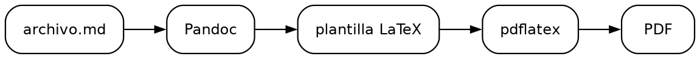

# Introducción

Este documento es un trabajo de mentira: su contenido es la propia sintaxis de
Markdown que el generador sabe convertir a PDF. Sirve para dos cosas. La primera
es de referencia, para copiar la forma correcta de escribir una tabla, un
diagrama o una nota al pie sin tener que acordarse. La segunda es de
comparación: si un trabajo tuyo sale raro, genera este archivo y mira la
diferencia, porque aquí todo está escrito siguiendo las reglas.

La regla que más importa es la más simple: **cada bloque va separado por una
línea vacía**. Antes y después de un encabezado, de una lista, de una tabla y de
un bloque de código. De ahí sale casi cualquier PDF mal formado.

## Lo que no se escribe aquí

En el Markdown no van ni la portada, ni el índice, ni el título del trabajo, ni
tu nombre, ni la materia, ni la fecha. Todo eso lo arma la plantilla con lo que
le pasas al comando y con el archivo `.env`, así que el documento empieza
directamente en la primera sección.

# Desarrollo

Los encabezados se escriben con almohadillas y un espacio después. El nivel
decide el formato APA que les toca, así que conviene no saltarse ninguno.

## Un encabezado de segundo nivel

Este es el nivel que se usa para los temas de la sección, y sale a la izquierda
en negrita.

### Un encabezado de tercer nivel

Para los subtemas. Sale a la izquierda en negrita cursiva.

#### Un encabezado de cuarto nivel

A partir de aquí el encabezado se mete en el párrafo, con sangría y punto final.

##### Un encabezado de quinto nivel

El último que distingue APA, en negrita cursiva y también dentro del párrafo.

## Texto y énfasis

Dentro de un párrafo caben la **negrita**, la *cursiva*, las ***dos a la vez***,
el `código en línea`, el ~~tachado~~ y el ==resaltado==. También los subíndices
como H~2~O y los superíndices como en el caso de X^2^. Cuando hace falta cortar
un renglón a propósito<br>se usa una etiqueta de salto, que es la forma que
nunca se pierde.

Una idea importante puede llevar una nota al pie[^nota], que aparece numerada al
final de la página. Un enlace se escribe [con su texto](https://www.latex-project.org),
y una dirección suelta como https://www.markdownguide.org también se convierte
en enlace sin hacer nada.

[^nota]: Las notas al pie se escriben en cualquier parte del documento; el PDF
las coloca al pie de la página que les corresponde.

## Listas

Las listas con viñetas usan un guion, y se anidan con dos espacios de sangría:

- Primer elemento de la lista
- Segundo elemento, con uno anidado debajo
  - El anidado va con dos espacios
- Tercer elemento

Las numeradas funcionan igual, con el número y un punto:

1. Primer paso del procedimiento
2. Segundo paso
3. Tercer paso

También hay listas de tareas, útiles para un avance o una lista de pendientes:

- [x] Redactar la introducción
- [ ] Terminar el análisis
- [ ] Revisar las referencias

Y listas de definición, para un glosario:

Ciclo de vida
: Conjunto ordenado de fases por las que atraviesa un sistema de software.

Prototipo
: Versión preliminar que se construye para obtener retroalimentación temprana.

## Citas

Lo que se cita textualmente va en una cita en bloque, con el signo de mayor que:

> La ingeniería de software es la aplicación de un enfoque sistemático,
> disciplinado y cuantificable al desarrollo, operación y mantenimiento del
> software.

## Tablas

Una tabla necesita la fila de guiones debajo de los encabezados; sin ella
Markdown no la reconoce y sale como un montón de barras. Los dos puntos en esa
fila deciden la alineación de cada columna:

| Modelo | Cuándo conviene | Riesgo |
|---|:---:|---:|
| Cascada | Requisitos estables | Bajo |
| Prototipos | Requisitos **poco claros** | Medio |
| Espiral | Proyectos grandes | Alto |

## Código

El código va dentro de un bloque delimitado por tres acentos graves. Si indicas
el lenguaje, además sale con los colores del resaltado de sintaxis:

```python
def area_del_circulo(radio: float) -> float:
    """Devuelve el área de un círculo."""
    return 3.14159 * radio ** 2
```

## Diagramas

Un esquema hecho con caracteres de dibujo tiene que ir **dentro de un bloque de
código**, aunque no sea código. Solo ahí la letra es de ancho fijo y el dibujo
conserva la alineación:

```
  Requisitos
      └──► Diseño
              └──► Codificación
                      └──► Pruebas

        ┌──────────── refinamiento ────────────┐
        │                                      │
        ▼                                      │
   Recolección  ──►  Construcción  ──►  Evaluación
```

## Cajas de nota

Para destacar algo sin romper el hilo del texto se usa una división con valla:
tres dos puntos, el tipo de caja, el contenido y otros tres dos puntos.

::: nota
Funcionan `nota`, `aviso`, `importante`, `ejemplo` y `definicion`. El título se
puede cambiar escribiendo `::: {.aviso title="Antes de entregar"}`.
:::

## Imágenes

Las imágenes se escriben con un signo de admiración delante del enlace. La ruta
se busca desde la carpeta donde está el archivo Markdown y desde la carpeta
`cache/` del proyecto; si es una dirección de internet se descarga sola la
primera vez. El tamaño se controla con `{width=...}` y el pie sale en formato
APA, encima de la imagen.

{width=85%}

## Diagramas dibujados

Un bloque de código marcado como `dot` no sale como texto: lo dibuja Graphviz y
se inserta como imagen vectorial. El `caption` es opcional.

```{.dot caption="Un diagrama dibujado con Graphviz"}
digraph {
  graph [rankdir=LR, ranksep=0.4];
  node  [shape=box, style=rounded, fontname="Helvetica", fontsize=11];
  edge  [arrowsize=0.7];

  "Markdown" -> "Pandoc" -> "LaTeX" -> "PDF";
}
```

## Fórmulas y símbolos

Las fórmulas en línea van entre signos de pesos, como en $E = mc^2$, y las que
ocupan su propio renglón entre dos:

$$\sum_{i=1}^{n} x_i = \frac{a + b}{2}$$

Los símbolos se pueden escribir directamente en el texto: ≠ ≤ ≥ ≈ ∈ ∑ √ ∞ π Δ
α β γ ✓ ✗ ± × ÷ °. Los emoji también funcionan 🚀 💡 ✅, aunque en un trabajo
académico conviene usarlos con mesura.

# Conclusión

Un documento que respeta estas reglas se convierte en PDF sin advertencias y sin
sorpresas: los encabezados entran al índice, las tablas se dibujan, los
diagramas quedan alineados y los símbolos salen compuestos. Cuando algo se ve
mal en un trabajo propio, casi siempre es una línea en blanco que falta, un
diagrama fuera de su bloque de código o texto pegado de otra herramienta con
espacios invisibles.

# Referencias

- Cone, M. (2024). *Markdown guide*. https://www.markdownguide.org

- Gruber, J. (2004). *Markdown: Syntax*. Daring Fireball.
  https://daringfireball.net/projects/markdown/syntax

- MacFarlane, J. (2025). *Pandoc user's guide*. https://pandoc.org/MANUAL.html
